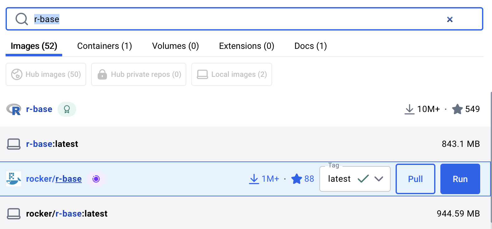
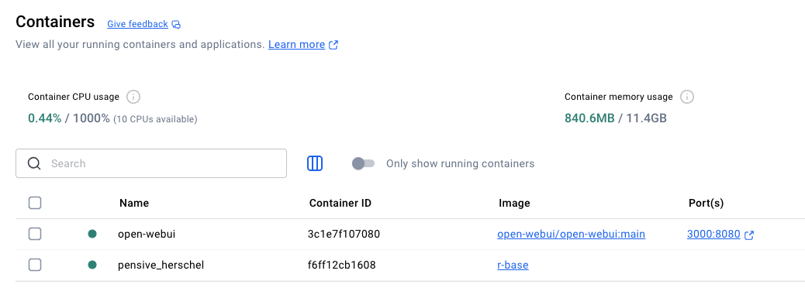

```{r, include = FALSE}
current_file <- knitr::current_input()
basename <- gsub(".[Rq]md$", "", current_file)

knitr::opts_chunk$set(
  fig.path = sprintf("images/%s/", basename),
  fig.width = 6,
  fig.height = 4,
  fig.align = "center",
  out.width = "100%",
  fig.retina = 3,
  echo = TRUE,
  warning = FALSE,
  message = FALSE,
  cache = TRUE,
  cache.path = "cache/"
)
```

## <br>[`r rmarkdown::metadata$pagetitle`]{.monash-blue .title} {#etc5513-title background-image="../common_images/bg-01.png"}

### `r rmarkdown::metadata$subtitle`

Lecturer: *`r rmarkdown::metadata$author`*

`r rmarkdown::metadata$department`

::: tl
<br>

<ul class="fa-ul">

<li>

[<i class="fas fa-envelope"></i>]{.fa-li}`r rmarkdown::metadata$email`

</li>

<li>

[<i class="fas fa-calendar-alt"></i>]{.fa-li} `r rmarkdown::metadata$date`

</li>

<li>

[<i class="fa-solid fa-globe"></i>]{.fa-li}<a href="`r rmarkdown::metadata[["unit-url"]]`">`r rmarkdown::metadata[["unit-url"]]`</a>

</li>

</ul>

<br>
:::

## Open Frame

{fig-align="center"}

## Recap

* Repositories give a project a shared home
* Quarto makes the report reproducible
* `renv` records the R package environment
* `targets` records the workflow and reruns only what is needed

::: {.fragment}
Today we move one layer lower: the computer environment itself.
:::

## Today's plan {#aim}

::: {.callout-important}

## Aim

* Explain what Docker adds to reproducible research
* Distinguish images, containers, registries, mounts, and volumes
* Run an R container using the Rocker images
* Write a small `Dockerfile` for an R project
* Use bind mounts and Docker Compose for a development environment
* Decide when Docker is worth using

:::

## A note on assessment

::: {.callout-tip}
Docker is included to show you the current gold standard for portable computational environments.
:::

You should understand the ideas and recognise the workflow.

You are not expected to memorise every Docker command for assessment.

# Why Docker?

## The familiar problem

::: {.columns}
::: {.column width="48%"}
It works on my machine.

```r
source("analysis.R")
quarto::quarto_render("report.qmd")
```
:::
::: {.column width="52%"}
But on someone else's machine:

* R is a different version
* A package was compiled differently
* A system library is missing
* The operating system behaves differently
* The project path is different
:::
:::

::: {.fragment}
Reproducibility is not only about code.
:::

## Layers of reproducibility

| Layer | Tool we have used | What it records |
| --- | --- | --- |
| Code history | `git` | What changed, when, and why |
| Documents | Quarto | Text, code, and outputs together |
| R packages | `renv` | Package versions for the project |
| Workflow | `targets` | What depends on what |
| Computer environment | Docker | Operating system, system libraries, and commands |

::: {.fragment}
Docker does not replace the earlier tools. It wraps them in a portable environment.
:::

## What Docker gives us

Docker lets us describe and run a small computer environment.

That environment can include:

* An operating system
* R and system libraries
* R packages
* Project files
* A default command to run

::: {.fragment}
The description is plain text, so it can be committed to `git`.
:::

## What Docker is not

Docker is not:

* A substitute for readable code
* A substitute for tests or checks
* A place to hide manual steps
* A magic fix for missing data
* Always worth the extra complexity

::: {.callout-tip}
Use Docker when the environment itself is part of the reproducibility problem.
:::

## A useful mental model

```text
Dockerfile  --->  image  --->  container
   recipe          frozen       running copy
                  template
```

::: {.fragment}
An image is like a saved template. A container is a running instance of that template.
:::

## Docker vocabulary

| Term | Meaning |
| --- | --- |
| `Dockerfile` | A text file with instructions to build an image |
| Image | A reusable template for a container |
| Container | A running environment created from an image |
| Registry | A place to publish and download images |
| Mount | A way to connect host files to a container |
| Volume | Storage managed by Docker |

## Containers and virtual machines

Containers are like virtual machines, but lighter.

| Virtual machine | Container |
| --- | --- |
| Simulates a whole computer | Shares the host system kernel |
| Usually larger | Usually smaller |
| Slower to start | Faster to start |
| Stronger isolation | Enough isolation for many data workflows |

::: {.fragment}
For reproducible R projects, containers are usually the more practical option.
:::

## Host and container

```text
Your laptop or server
  |
  | docker run
  v
Container
  - Linux
  - R
  - packages
  - project code
```

The container is isolated, but it can still connect to:

* Files you mount from the host
* Ports you expose to the host
* The internet, if available

# Running Containers

## Install Docker Desktop

Docker Desktop gives us:

* The Docker engine
* A visual interface
* Image and container management
* Logs and resource information

Download: <https://www.docker.com/products/docker-desktop>

::: {.fragment}
After installation, open Docker Desktop before running Docker commands.
:::

## Check that Docker is working

In the terminal:

```bash
docker --version
docker run hello-world
```

If Docker is working, `hello-world` downloads a tiny image and runs it.

::: {.fragment}
This is the smallest possible "does my Docker setup work?" check.
:::

## R images from Rocker

The [Rocker project](https://rocker-project.org/) provides Docker images for R.

Common examples include:

* `r-base`: a minimal R image
* `rocker/r-ver`: versioned R images
* `rocker/rstudio`: RStudio Server in a browser
* `rocker/verse`: RStudio plus many common data science tools

::: {.fragment}
Rocker saves us from writing a full Linux and R installation from scratch.
:::

## Search and pull in Docker Desktop

{fig-align="center"}

Docker Desktop can search for images and download them.

::: {.fragment}
For teaching, the terminal is still clearer because the command documents exactly what happened.
:::

## Run a basic R container

```bash
docker run -ti --rm r-base
```

This starts R inside a container.

::: {.fragment}
The prompt looks familiar, but R is running inside the container, not directly on your computer.
:::

## Command flags

```bash
docker run -ti --rm r-base
```

* `run` creates and starts a container
* `-t` gives the container a terminal
* `-i` keeps input open
* `--rm` removes the container after it stops
* `r-base` is the image name

::: {.fragment}
Use `q()` to exit the R session.
:::

## Is the container running?

{fig-align="center"}

You can also check in the terminal:

```bash
docker ps
```

For stopped containers:

```bash
docker ps -a
```

## Containers are disposable by default

Start a container:

```bash
docker run -ti --rm r-base
```

Install a package by hand inside it.

Exit the container.

Start the container again.

::: {.fragment}
The package is gone. That is a feature, not a bug.
:::

## Why disposable is good

Disposable containers make it harder to accidentally depend on:

* Packages installed by hand
* Objects left in memory
* Files saved in an unknown place
* Local configuration on one person's computer

::: {.callout-tip}
If you need something every time, put it in the image or mount it from the host.
:::

# Images And Dockerfiles

## A Dockerfile is a recipe

A `Dockerfile` describes how to build an image.

```dockerfile
FROM r-base
```

This says: start from the `r-base` image.

::: {.fragment}
Every image builds on another image, unless it starts from scratch.
:::

## Add packages

```dockerfile
FROM r-base

RUN Rscript -e "install.packages(c('palmerpenguins', 'dplyr', 'ggplot2'))"
```

`RUN` executes a command while the image is being built.

::: {.fragment}
After the image is built, these packages are part of the image.
:::

## Add a default command

```dockerfile
FROM r-base

RUN Rscript -e "install.packages(c('palmerpenguins', 'dplyr', 'ggplot2'))"

CMD ["R"]
```

`CMD` says what should happen when a container starts.

::: {.fragment}
Here the default behaviour is to open R.
:::

## Build the image

In the folder containing the `Dockerfile`:

```bash
docker build -t penguins-r .
```

Then run it:

```bash
docker run -ti --rm penguins-r
```

::: {.fragment}
The `.` at the end of `docker build` means "use this folder as the build context".
:::

## Image tags

```bash
docker build -t penguins-r .
docker build -t penguins-r:week11 .
docker build -t yourname/penguins-r:week11 .
```

Tags are labels for images.

::: {.fragment}
Avoid relying on `latest` when you need long-term reproducibility.
:::

## Pin the base image

Less reproducible:

```dockerfile
FROM rocker/r-ver
```

More reproducible:

```dockerfile
FROM rocker/r-ver:4.4.3
```

::: {.fragment}
The second version says exactly which R version family the image starts from.
:::

## Project Dockerfile pattern

For an R project using `renv`:

```dockerfile
FROM rocker/r-ver:4.4.3

WORKDIR /project

ENV RENV_PATHS_LIBRARY=/opt/renv/library
ENV RENV_PATHS_CACHE=/opt/renv/cache

ARG QUARTO_VERSION=1.8.27

RUN apt-get update \
    && apt-get install -y --no-install-recommends curl ca-certificates \
    && arch="$(dpkg --print-architecture)" \
    && curl -L -o quarto.deb \
      "https://github.com/quarto-dev/quarto-cli/releases/download/v${QUARTO_VERSION}/quarto-${QUARTO_VERSION}-linux-${arch}.deb" \
    && apt-get install -y ./quarto.deb \
    && quarto --version \
    && rm quarto.deb \
    && rm -rf /var/lib/apt/lists/*

RUN Rscript -e "install.packages('renv')"

COPY .Rprofile .Rprofile
COPY renv.lock renv.lock
COPY renv/activate.R renv/activate.R
COPY renv/settings.json renv/settings.json

RUN Rscript -e "renv::restore(prompt = FALSE)"

COPY . .

CMD ["Rscript", "-e", "renv::load('/project'); targets::tar_make()"]
```

::: {.fragment}
`renv::restore()` installs packages into `/opt/renv/library`. `renv::load()` makes sure that library is used when the container starts.
:::

::: {.fragment}
Putting the library outside `/project` matters because a bind mount can replace `/project` at runtime.
:::

::: {.fragment}
The Quarto CLI is installed separately because the R package `quarto` does not provide the `quarto` command.
:::

## Why copy `renv.lock` first?

Docker builds in layers.

If the package lockfile has not changed, Docker can reuse the package installation layer.

```dockerfile
COPY .Rprofile .Rprofile
COPY renv.lock renv.lock
COPY renv/activate.R renv/activate.R
COPY renv/settings.json renv/settings.json
RUN Rscript -e "renv::restore(prompt = FALSE)"

COPY . .
```

::: {.fragment}
This makes rebuilds much faster when only your analysis code changes.
:::

## The `.dockerignore` file

The build context should not include everything.

```text
.git
.Rproj.user
_targets
renv/library
cache
*.html
*.pdf
*.RData
*.Rhistory
```

::: {.fragment}
This keeps images smaller and avoids copying local machine state into the container.
:::

## Copying project files

A containerised analysis image might include:

```text
_targets.R
R/
data/
report.qmd
.Rprofile
renv.lock
renv/activate.R
renv/settings.json
Dockerfile
```

Usually avoid copying:

```text
.git/
_targets/
renv/library/
private credentials
large generated outputs
```

## A useful rule

::: {.callout-tip}
Commit the recipe, not the leftovers.
:::

In `git`, keep:

* `Dockerfile`
* `.dockerignore`
* `renv.lock`
* Project source files

Do not commit the built image itself.

# Getting Work In And Out

## Three storage patterns

| Pattern | What happens | Good for |
| --- | --- | --- |
| Container filesystem | Files live inside one container | Short experiments |
| Bind mount | Host folder appears inside container | Active development |
| Named volume | Docker manages persistent storage | Databases and service data |

::: {.fragment}
For this unit, bind mounts are the most useful pattern.
:::

## Bind mount a project folder

```bash
docker run -ti --rm \
  --mount type=bind,source="${PWD}",target=/project \
  -w /project \
  rocker/r-ver:4.4.3
```

This means:

* The current folder on your computer appears as `/project`
* The container starts in `/project`
* Changes are saved on your computer

## Why bind mounts matter

Without a bind mount:

```text
edit on host -> not visible in container
write in container -> disappears when container is removed
```

With a bind mount:

```text
edit on host <-> visible in container
write in container <-> saved on host
```

::: {.fragment}
This is how we use Docker while still editing files normally.
:::

## RStudio Server in Docker

RStudio Server runs in the container and opens in your browser.

```bash
docker run --rm -d \
  -p 8787:8787 \
  -e PASSWORD=changeme \
  --mount type=bind,source="${PWD}",target=/home/rstudio/project \
  rocker/rstudio
```

Then open:

```text
http://localhost:8787
```

## What the flags mean

```bash
docker run --rm -d -p 8787:8787 -e PASSWORD=changeme rocker/rstudio
```

* `-d` runs the container in the background
* `-p 8787:8787` maps a browser port to the container
* `-e PASSWORD=changeme` sets an environment variable
* `--rm` removes the container when it stops

::: {.fragment}
Use a stronger password for anything that is not just local teaching work.
:::

## Stop the container

List running containers:

```bash
docker ps
```

Stop one:

```bash
docker stop <container-id>
```

::: {.fragment}
You only need enough of the container ID to make it unique.
:::

## Named volumes

Create a Docker-managed volume:

```bash
docker volume create mydata
```

Use it:

```bash
docker run --rm \
  --mount type=volume,source=mydata,target=/app/data \
  myimage
```

::: {.fragment}
Volumes are useful when the data belongs to the service, not directly to your project folder.
:::

## Bind mounts versus volumes

| Feature | Bind mount | Named volume |
| --- | --- | --- |
| Managed by | You | Docker |
| Easy to inspect in Finder or Explorer | Yes | Less directly |
| Portable across computers | Depends on path | Managed by Docker |
| Best for | Code and project files | Databases and service state |

## Permissions

Bind mounts can expose permission differences between:

* macOS
* Windows
* Linux
* The user inside the container

Symptoms include:

* Files created by the container cannot be edited on the host
* R cannot write to a mounted project folder
* Package libraries are not writable

::: {.fragment}
This is normal Docker friction. It is not a sign that the project is broken.
:::

# Docker Compose

## The problem with long commands

This is useful, but hard to remember:

```bash
docker run --rm -d \
  -p 8787:8787 \
  -e PASSWORD=changeme \
  --mount type=bind,source="${PWD}",target=/home/rstudio/project \
  rocker/rstudio
```

::: {.fragment}
Docker Compose lets us write this configuration once.
:::

## A Compose file

`compose.yaml`

```yaml
services:
  rstudio:
    image: rocker/rstudio
    ports:
      - "8787:8787"
    environment:
      PASSWORD: changeme
    volumes:
      - .:/home/rstudio/project
    working_dir: /home/rstudio/project
```

Run:

```bash
docker compose up -d
```

## Stopping Compose services

```bash
docker compose ps
docker compose logs
docker compose down
```

::: {.fragment}
Older examples may use `docker-compose`. The newer command is `docker compose`.
:::

## Multiple services

Some projects need more than R.

```yaml
services:
  rstudio:
    image: rocker/rstudio
    ports:
      - "8787:8787"
    environment:
      PASSWORD: changeme
    volumes:
      - .:/home/rstudio/project

  db:
    image: postgres
    environment:
      POSTGRES_PASSWORD: example
    volumes:
      - pgdata:/var/lib/postgresql/data

volumes:
  pgdata:
```

## Why multiple services?

A data science project might use:

* RStudio Server for analysis
* PostgreSQL for a database
* A web app for results
* A separate service for an API

::: {.fragment}
Compose describes the small system, not just one container.
:::

## Environment variables

Environment variables configure software without hard-coding values.

```yaml
services:
  rstudio:
    image: rocker/rstudio
    environment:
      PASSWORD: changeme
      RENV_CONFIG_REPOS_OVERRIDE: https://packagemanager.posit.co/cran/latest
```

Common uses:

* Passwords for local services
* API endpoints
* R package repository settings
* Application configuration

## Secrets warning

::: {.callout-warning}
Do not commit real passwords, API keys, or tokens to a repository.
:::

For real projects, use:

* `.env` files that are not committed
* GitHub Actions secrets
* A password manager
* Cloud secret stores

# Docker In A Reproducible Workflow

## How the pieces fit together

```text
git
  records project source

renv
  records R packages

targets
  records the analysis workflow

Docker
  records the computer environment
```

::: {.fragment}
The strongest projects use these tools together, each doing a different job.
:::

## A containerised targets workflow

```dockerfile
FROM rocker/r-ver:4.4.3

WORKDIR /project

ENV RENV_PATHS_LIBRARY=/opt/renv/library
ENV RENV_PATHS_CACHE=/opt/renv/cache

ARG QUARTO_VERSION=1.8.27

RUN apt-get update \
    && apt-get install -y --no-install-recommends curl ca-certificates \
    && arch="$(dpkg --print-architecture)" \
    && curl -L -o quarto.deb \
      "https://github.com/quarto-dev/quarto-cli/releases/download/v${QUARTO_VERSION}/quarto-${QUARTO_VERSION}-linux-${arch}.deb" \
    && apt-get install -y ./quarto.deb \
    && quarto --version \
    && rm quarto.deb \
    && rm -rf /var/lib/apt/lists/*

RUN Rscript -e "install.packages('renv')"

COPY .Rprofile .Rprofile
COPY renv.lock renv.lock
COPY renv/activate.R renv/activate.R
COPY renv/settings.json renv/settings.json
RUN Rscript -e "renv::restore(prompt = FALSE)"

COPY . .

CMD ["Rscript", "-e", "renv::load('/project'); targets::tar_make()"]
```

Then:

```bash
docker build -t my-analysis .
docker run --rm my-analysis
```

## What this gives the collaborator

Instead of saying:

```text
Install R, install packages, maybe install system libraries,
then run these scripts in this order.
```

You can say:

```bash
docker build -t my-analysis .
docker run --rm my-analysis
```

::: {.fragment}
That is a much smaller surface area for mistakes.
:::

## But Docker is not enough

A Docker image can still fail if:

* Required data are missing
* Private credentials are unavailable
* The analysis uses absolute paths
* The Dockerfile depends on changing remote resources
* Results depend on randomness without fixed seeds
* The instructions are not documented

::: {.fragment}
Docker reduces environment drift. It does not remove the need for good project design.
:::

## When Docker is worth it

Use Docker when:

* Collaborators have different operating systems
* The project needs system libraries
* You need to deploy an analysis or app
* A journal, client, or supervisor needs a runnable environment
* You want automated checks to run in the same environment every time

## When Docker may be too much

For a small class project, you may be fine with:

* A clear folder structure
* A Quarto report
* `renv.lock`
* A short README
* A `targets` pipeline for larger analyses

::: {.callout-tip}
Choose the simplest tool that makes the project trustworthy.
:::

# Sharing Images

## Registries

A registry stores Docker images.

Common options:

* Docker Hub
* GitHub Container Registry
* A private registry inside an organisation

::: {.fragment}
This is like GitHub for built environments, but the object being shared is an image.
:::

## Push an image

Login:

```bash
docker login
```

Build with a registry-ready name:

```bash
docker build -t yourname/my-analysis:week11 .
```

Push:

```bash
docker push yourname/my-analysis:week11
```

## Pull and run

Someone else can run:

```bash
docker pull yourname/my-analysis:week11
docker run --rm yourname/my-analysis:week11
```

::: {.fragment}
For long-term projects, also keep the `Dockerfile` in the repository so the image can be rebuilt.
:::

## Images can get large

Images include operating system files, libraries, R, packages, and maybe project files.

Ways to keep them manageable:

* Use `.dockerignore`
* Avoid copying large generated outputs
* Start from an appropriate base image
* Clean package manager caches when installing system libraries
* Rebuild only when needed

## Cleaning up

Docker can accumulate:

* Stopped containers
* Old images
* Unused volumes
* Build cache

Inspect first:

```bash
docker system df
```

Clean cautiously:

```bash
docker system prune
```

::: {.callout-warning}
`docker system prune` deletes stopped containers and unused build objects. Read the prompt before confirming.
:::

# Worked Example

## Containerise a small analysis

Imagine this project:

```text
penguins-analysis/
|-- _targets.R
|-- R/
|   |-- data.R
|   `-- plots.R
|-- report.qmd
|-- .Rprofile
|-- renv.lock
|-- renv/
|   |-- activate.R
|   `-- settings.json
|-- .dockerignore
`-- Dockerfile
```

The goal:

```bash
docker run --rm penguins-analysis
```

should rebuild the analysis.

## `_targets.R`

```r
library(targets)
library(tarchetypes)

tar_source()

tar_option_set(
  packages = c("palmerpenguins", "dplyr", "ggplot2")
)

list(
  tar_target(raw_data, palmerpenguins::penguins),
  tar_target(clean_data, clean_penguins(raw_data)),
  tar_target(species_plot, plot_species(clean_data)),
  tar_quarto(report, "report.qmd")
)
```

## `Dockerfile`

```dockerfile
FROM rocker/r-ver:4.4.3

WORKDIR /project

ENV RENV_PATHS_LIBRARY=/opt/renv/library
ENV RENV_PATHS_CACHE=/opt/renv/cache

ARG QUARTO_VERSION=1.8.27

RUN apt-get update \
    && apt-get install -y --no-install-recommends curl ca-certificates \
    && arch="$(dpkg --print-architecture)" \
    && curl -L -o quarto.deb \
      "https://github.com/quarto-dev/quarto-cli/releases/download/v${QUARTO_VERSION}/quarto-${QUARTO_VERSION}-linux-${arch}.deb" \
    && apt-get install -y ./quarto.deb \
    && quarto --version \
    && rm quarto.deb \
    && rm -rf /var/lib/apt/lists/*

RUN Rscript -e "install.packages('renv')"

COPY .Rprofile .Rprofile
COPY renv.lock renv.lock
COPY renv/activate.R renv/activate.R
COPY renv/settings.json renv/settings.json
RUN Rscript -e "renv::restore(prompt = FALSE)"

COPY . .

CMD ["Rscript", "-e", "renv::load('/project'); targets::tar_make()"]
```

## Build and run

```bash
docker build -t penguins-analysis .
docker run --rm penguins-analysis
```

If the report is written inside the container, remember:

::: {.fragment}
Without a mount, the output stays inside the container and disappears when the container is removed.
:::

## Keep outputs on the host

```bash
docker run --rm \
  --mount type=bind,source="${PWD}",target=/project \
  -w /project \
  penguins-analysis
```

Now rendered outputs are written to your project folder.

::: {.fragment}
This is usually what you want while developing.
:::

::: {.fragment}
The package library still comes from the image because it is stored in `/opt/renv/library`, not under the mounted `/project` folder.
:::

# Practical Advice

## Common mistakes

* Forgetting that containers are disposable
* Copying `_targets/` into the image
* Copying `renv/library/` into the image
* Restoring with `renv` but not activating the project library at runtime
* Restoring packages into `/project/renv/library` and then hiding them with a bind mount
* Installing the R package `quarto` but forgetting the Quarto CLI
* Relying on `latest` tags for long-term work
* Installing packages interactively but not updating the Dockerfile or `renv.lock`
* Using absolute paths from the host machine
* Committing secrets inside `compose.yaml`

## A good Docker README section

````markdown
## Reproduce with Docker

Build the image:

```bash
docker build -t my-analysis .
```

Run the analysis:

```bash
docker run --rm \
  --mount type=bind,source="${PWD}",target=/project \
  -w /project \
  my-analysis
```
````

::: {.fragment}
Make the default path easy for a new person to follow.
:::

## Minimal project checklist

Before sharing a Dockerised project, check:

* `Dockerfile` builds from a clean clone
* `.dockerignore` excludes local state
* `renv.lock` is current
* `targets::tar_make()` runs inside the container
* Outputs can be written somewhere useful
* README explains build and run commands

## How to debug a container

Open a shell inside the image:

```bash
docker run -ti --rm my-analysis bash
```

Then inspect:

```bash
pwd
ls
R --version
Rscript -e "renv::status()"
Rscript -e "targets::tar_validate()"
```

::: {.fragment}
Debug the environment first, then the analysis.
:::

## The main trade-off

::: {.columns}
::: {.column width="50%"}
Docker costs:

* More files
* More concepts
* Larger downloads
* More setup time
* Occasional permissions issues
:::
::: {.column width="50%"}
Docker buys:

* Portable environments
* Fewer "works on my machine" problems
* Deployment readiness
* Stronger automated checks
* A clear computational record
:::
:::

## Summary

* Docker describes and runs portable computational environments
* Images are templates; containers are running instances
* `Dockerfile` records how an image is built
* Bind mounts connect project files to containers
* Docker Compose records longer container configurations
* Docker complements `git`, Quarto, `renv`, and `targets`

## Final thought

::: {.callout-tip}
Reproducibility is a ladder. Docker is one of the higher rungs, not the first one.
:::

Start with clear code, relative paths, version control, package management, and a runnable workflow.

Then use Docker when the environment needs to be part of the project.
