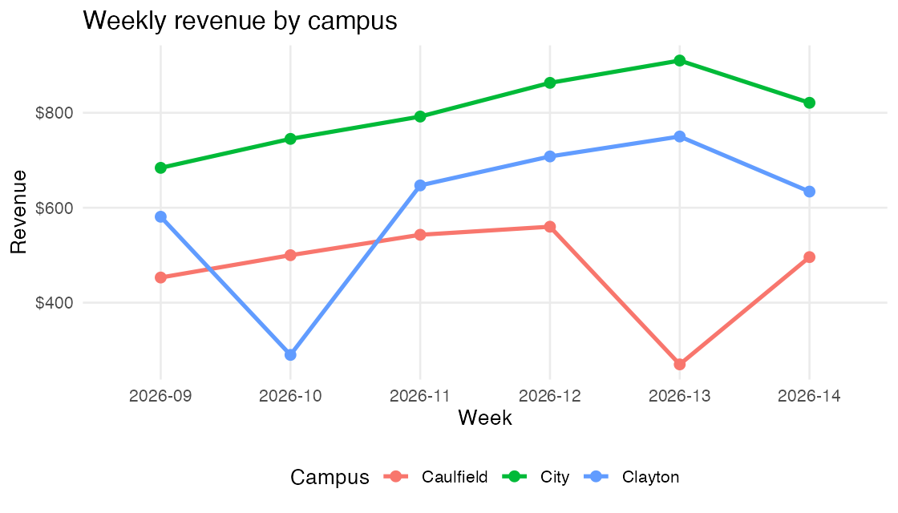

```{r}
library(readr)
library(dplyr)
library(knitr)

campus_summary <- read_csv("outputs/campus_summary.csv", show_col_types = FALSE)
weekly_summary <- read_csv("outputs/weekly_summary.csv", show_col_types = FALSE)
```

## Overview

This report summarises cafe sales by campus for the first six weeks of semester.

Across the analysis period, the cafes recorded `r sum(campus_summary$orders)` completed order groups and total revenue of `$` `r format(round(sum(campus_summary$revenue), 0), big.mark = ",")`.

## Campus summary

```{r}
campus_summary |>
  mutate(
    revenue = round(revenue, 2),
    margin = round(margin, 2),
    average_order = round(average_order, 2)
  ) |>
  kable()
```

## Weekly revenue



## Interpretation

Revenue increased through the middle of the period, with the City campus contributing the largest share of sales. The repaired project now makes that claim from a single reproducible pipeline rather than from manual output files.

